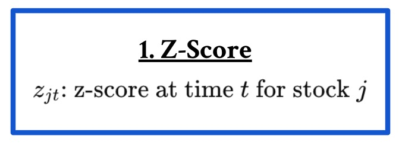
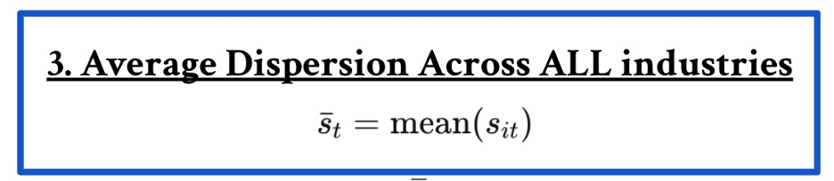
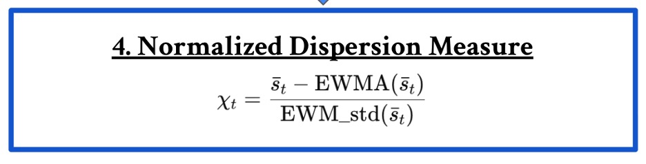
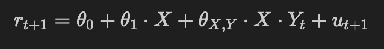

# Research Report

**Project Title: Testing Signals as IC Conditioners**  
**Author(s): Alyssa Hall**  
**Date: 4/15/26**  
**Version: 1**  

---

## 1. Summary

In quantitative finance, the Information Coefficient (IC) measures how well a signal predicts future stock returns. A common assumption in many models is that the IC is constant over time. However, in practice this is rarely true. The predictive strength of signals such as momentum or reversal often changes depending on market conditions. The goal of this project is to test whether the dispersion of a signal can be used to predict when the IC will be strong or weak.

I tested momentum and reversal to see if they were valid IC conditioners; however, these results were not statistically significant. I am hopeful that someone who picks up this research might be able test accruals and some other possible signals using this framework.

### Key Metrics

| Metric | Notes |
|------|------|
| Interaction Coefficient | Indicates the relationship between a signal's alpha and its dispersion |
| T-Stat of Interaction Coefficient | Indicates the statistical significance of the interaction coefficient |

## 2. Data Requirements

Describe data dependencies.

**Sources/Inputs Required**
-  Exposures Matrix
-  Scores for your signal(s)
-  Alphas for your signal(s)

**Rate of Availability**
-  I just asked the Silver Fund leaders to get all of this above data from production; they have information for reversal, momentum, beta, ivol, barra_momentum, and barra_reversal.
-  However, if you are using a different signal, you will have to do some digging and search for the data on your own.

**Preprocessing**
-  Filter out any signals that you don't want to test if your scores and alphas files contain extra signals.

---

## 3. Approach / System Design

The idea behind dispersion is simple.
If a signal has low dispersion, then most stocks look very similar. Nothing stands out clearly as a strong buy or a strong sell. In that situation, the signal may mostly reflect noise, so we expect the IC to be weak.
If a signal has high dispersion, then some stocks clearly stand out from the rest. There is a stronger structure in the cross-section, and the signal is more informative. In this case, we expect the IC to be stronger.

A key issue with raw dispersion is that it can be misleading. If one industry has high momentum and another has low momentum, the signal may appear very spread out even though stocks are actually very similar within each industry. In that case, the predictive power may come from industry trends rather than true stock-level information.
To address this, we construct a dispersion measure that focuses on dispersion within industries instead of across the entire market.
The dispersion signal is built in four steps:

1. Within-industry standardization
For stock (j) at time (t),
 


2. Within-industry dispersion
For each industry (i), compute the dispersion of the standardized signal:


3. Cross-industry average dispersion



This gives one dispersion number for the entire market at time (t).

4. IC-conditioner (standardized dispersion)
Finally, we normalize dispersion using an EWM mean and standard deviation:



This produces a standardized time-series that tells us whether dispersion is currently high or low relative to its historical level.

**Testing Our Hypothesis**
To test whether dispersion helps predict the IC, we run the regression



where:

(X) = the signal forecast (momentum or reversal)

(Yt) = the dispersion measure defined above

(X Yt) = interaction term used to test whether the predictive power of the signal changes when dispersion changes

**Interpretation**

If (θX,Y  = 0): dispersion does not affect the signal’s IC

If (θX,Y  ≠ 0): dispersion helps predict when the signal will be more accurate

In other words, the regression tests whether the IC of the signal is conditional on dispersion.

---

## 4. Code Structure

If signal research:

```
sf-signal/
├── src/
│   ├── framework/
│   │   ├── ew_dash.py            # Equal-weight dashboard (do not edit)
│   │   ├── opt_dash.py           # Optimal portfolio dashboard (do not edit)
│   │   └── run_backtest.py       # Run the backtest (edit config only)
│   └── signal/
│       └── create_signal.py      # Your signal implementation (edit this)
├── data/
│   ├── signal.parquet            # Output: Your signal
│   └── weights/                  # Output: Backtest weights
└── README.md
```

### 1. **Implement Signal** (`create_signal.py`)
   - Customize date ranges, data columns, and calculation logic
   - Develop your signal logic
   - Saves signal to `data/signal.parquet`

   ```bash
   make create-signal
   ```

### 2. **View Equal-Weight Performance** (`ew_dash.py`)
   - Compare your signal against an equal-weight baseline
   - Analyze signal characteristics
   - Visualize signal properties and performance

   ```bash
   make ew-dash
   ```

### 3. **Run Backtest** (`run_backtest.py`)
   - Run MVO-based backtest on your signal
   - Generates optimal portfolio weights
   - Saves results to `data/weights.parquet`

   ```bash
   make backtest
   ```

### 4. **View Optimized Performance** (`opt_dash.py`)
   - View optimized portfolio performance
   - Analyze backtest returns, drawdowns, and metrics

   ```bash
   make opt-dash
   ```

If other than signal research, describe organization of implementation.

```
Example:
project/
├── data/
├── src/
├── scripts/
├── results/
└── docs/
```

Explain:

- Main pipeline or workflow
- Important modules
- Execution instructions

---

## 5. Results / Evaluation

Include relevant evidence demonstrating performance.

For signals:

- Cumulative IC table
- Possibly quantile plots
- Active portfolio backtest
- Summary statistic tables
- Other useful tables and plots

Possible items:

- Tables
- Plots
- Benchmarks

Add anything useful for interpreting system behavior.

---

## 6. Performance Discussion

Discuss:

- Strengths
- Weaknesses
- Sensitivity to assumptions or parameters

---

## 7. Limitations

- Known issues:
- Missing features:
- Risks:
- Open questions:

---

## 8. Future Work

Ideas for improvement or continuation:

-  
-  
-  

---

## Appendix (Optional)

### A. Additional Results

### B. Experimental Details

### C. Reproducibility Notes
